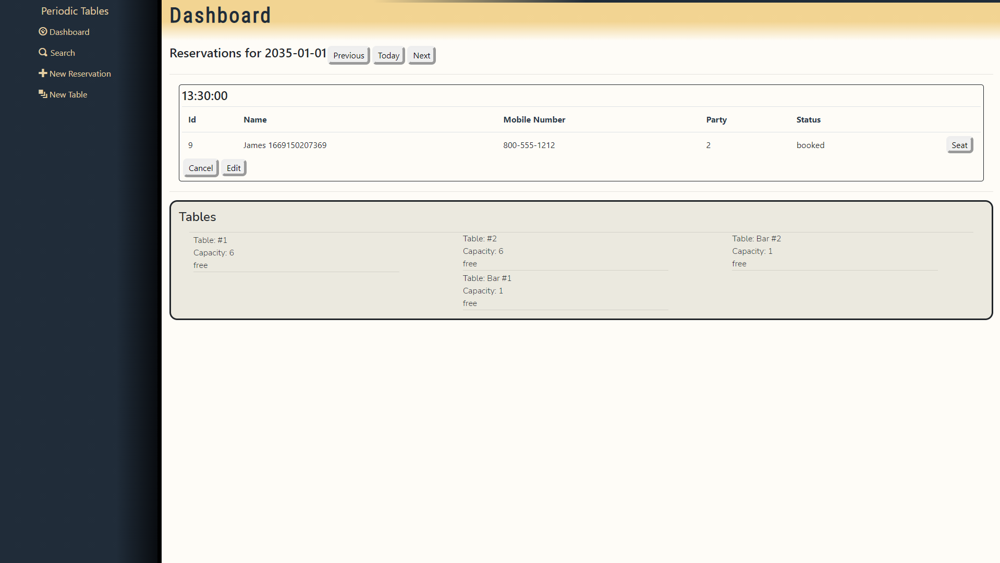

# Periodic Tables Restaurant Reservation System

### deployed application links:
front end - https://periodic-tables-front-end-0uz9.onrender.com
back end - https://periodic-tables-back-end-hxym.onrender.com

### application summary:
Periodic Tables is a restaurant reservation web app intended to be used by restaurant staff and management. Its purpose is assisting in keeping track of and organizing customer reservations and available tables within the user's establishment.

This repository is set up as a monorepo, meaning that the frontend and backend projects are in one repository. This allows you to open both projects in the same editor.

### installation: 
1. Fork and clone this repository.
1. Run cp ./back-end/.env.sample ./back-end/.env.
1. Update the ./back-end/.env file with the connection URL's to your ElephantSQL database instance.
1. Run cp ./front-end/.env.sample ./front-end/.env.
1. You should not need to make changes to the ./front-end/.env file unless you want to connect to a backend at a location other than http://localhost:5001.
1. Run npm install to install project dependencies.
1. Run npm run start:dev to start your server in development mode.

### technology:
This app was built following a PERN stack, PostgreSQL, Express, React, Node. Front end routing accomplished with react-router-dom. Styling accomplished with bootstrap and vanilla css.

### documentation:
**dashboard** - The dashboard is displayed from the home path, it stores and shows created reservations for the specified date as well as created tables for the establishment. reservations can be edited from the dashboard by clicking the edit button on an accompanying reservation. A reservation also has the ability to be cancelled and removed from the dashboard with the cancel button on the accompanying reservation.

**new reservation** - new reservation is a form which when submitted with information adds the reservation to the dashboard for the specified date.

**seat reservation** - seat reservation page gives the user the ability to seat a current reservation. Upon submitting, the dashboard is updated to show that the selected table is now occupied and cannot be seated until the reservation is finished. Reservations are finished whenever the user clicks the finish button on a table occupied by a reservation.

**new table** - new table is a form which when submitted with information adds the table to the dashboard as a new table ready for seating.

**search** - the search is a form which requires a partially or fully matching phone number and retrieves any current matching reservations.

### api:
/reservations
- GET: returns array of all reservations regardless of status
- POST: creates a new reservation record within the database ex. valid body {first_name: 'firstName', last_name: 'lastName', mobile_number: '888-888-8888', reservation_date: '08-08-2025', reservation_time: '20:00', people: 5}

/reservations/:reservationId
- Get: returns record of a reservation with a matching reservation_id within the database
- PUT: updates record of a reservation within the database with a matching reservation_id ex. valid body {reservation_id: 'reservationId, first_name: 'firstName', last_name: 'lastName', mobile_number: '888-888-8888', reservation_date: '08-08-2025', reservation_time: '20:00', people: 5}
- DELETE: removes the reservation which has the matching reservation_id from the database

/reservations/:reservationId/status
- PUT: updates status from the current value to either a value of booked, seated, or finished. ex. valid body {status: newStatus}

/tables
- GET: returns array of all tables within the database
- POST: creates a new entry in the database for a table ex. valid body {table_name: 'tableName', capacity: 1}

/tables/:tableId/seat
- PUT: updates status of a table to either free or occupied. ex. valid body {reservation_id: reservationId }
- DELETE: removes a table entry with a matching table_id from the database
